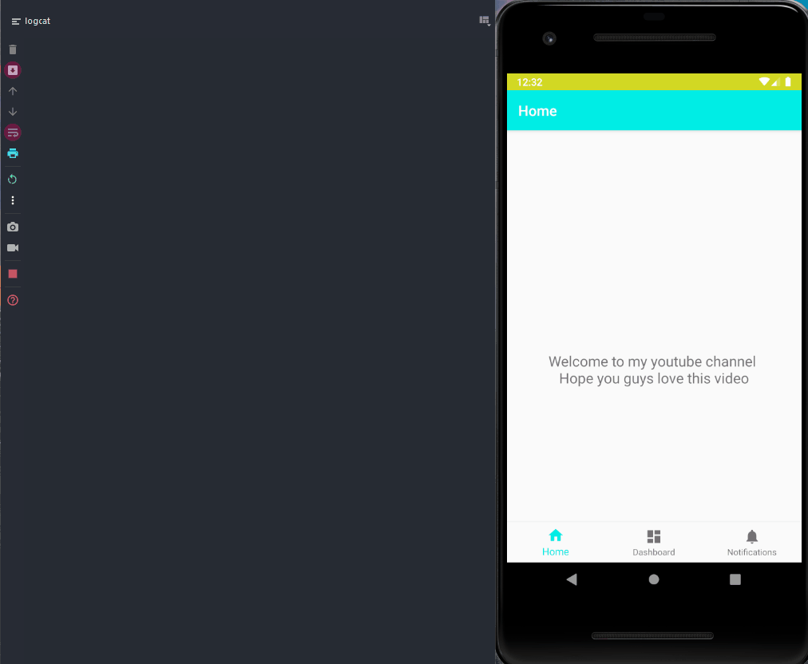

<p align="center">
  <a href="https://img.shields.io/badge/License-MIT-yellow.svg"></a>
  <a href="https://badges.frapsoft.com/os/v2/open-source.svg?v=103"></a>
</p>

# Android Analytics Architecture
Analytics are really helpful to the developer. It gives us more insights on users behavior towards the application and also helps you to develop features depending on their behavior
and liking which gives more success to the developer.

This project is useful in defining your analytics layer. I just created this project in a simple manner to explain how I define my rules in creating an analytics layer in my project.
This is also helpful to the people who have multi module project. With the idea I have presented, you need not expose all the events to all modules. Each module can have it's own analytics
layer which takes info from core-analytics layer. So, that it encapsulates info like you needed.

This is pretty flexible.
If your boss asks you to add a different analytics service. It will be super easy for the dev to add one more layer and prototype it to the requested persons. That's the part the dev 
will enjoy this hardwork.


## TODO 🔨
🛠️ Write Unit tests to show how this implementation won't get coupled with your business logic

##  Animated Gif 📷


## License
```
MIT License

Copyright (c) 2020 Sri Harsha Pothineni

Permission is hereby granted, free of charge, to any person obtaining a copy
of this software and associated documentation files (the "Software"), to deal
in the Software without restriction, including without limitation the rights
to use, copy, modify, merge, publish, distribute, sublicense, and/or sell
copies of the Software, and to permit persons to whom the Software is
furnished to do so, subject to the following conditions:

The above copyright notice and this permission notice shall be included in all
copies or substantial portions of the Software.

THE SOFTWARE IS PROVIDED "AS IS", WITHOUT WARRANTY OF ANY KIND, EXPRESS OR
IMPLIED, INCLUDING BUT NOT LIMITED TO THE WARRANTIES OF MERCHANTABILITY,
FITNESS FOR A PARTICULAR PURPOSE AND NONINFRINGEMENT. IN NO EVENT SHALL THE
AUTHORS OR COPYRIGHT HOLDERS BE LIABLE FOR ANY CLAIM, DAMAGES OR OTHER
LIABILITY, WHETHER IN AN ACTION OF CONTRACT, TORT OR OTHERWISE, ARISING FROM,
OUT OF OR IN CONNECTION WITH THE SOFTWARE OR THE USE OR OTHER DEALINGS IN THE
SOFTWARE.
```
